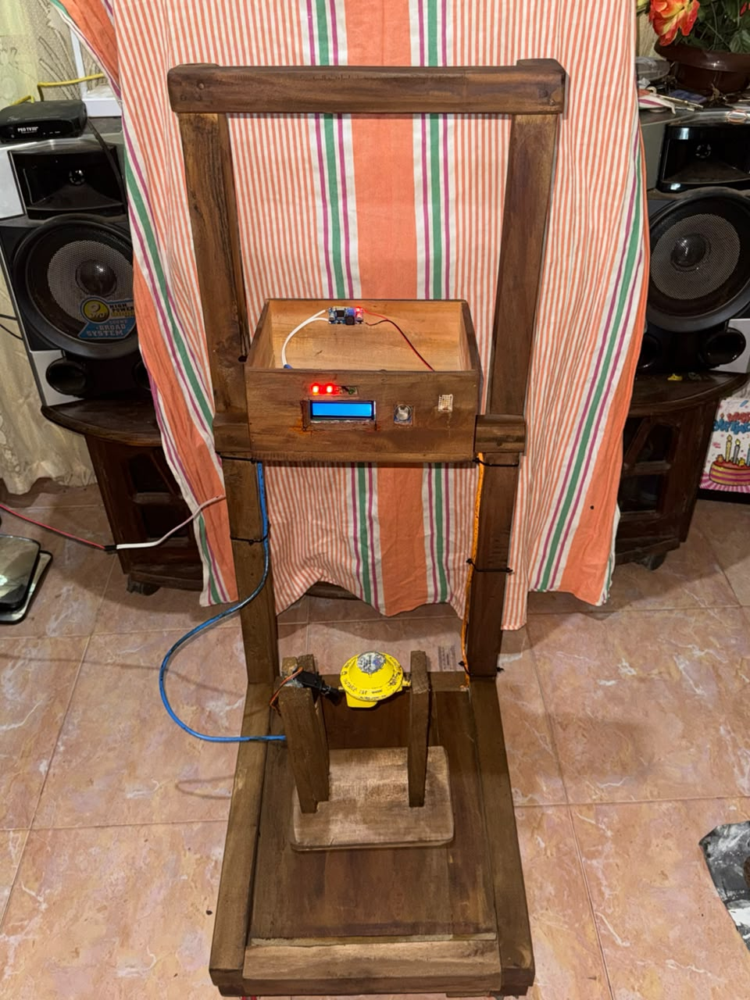
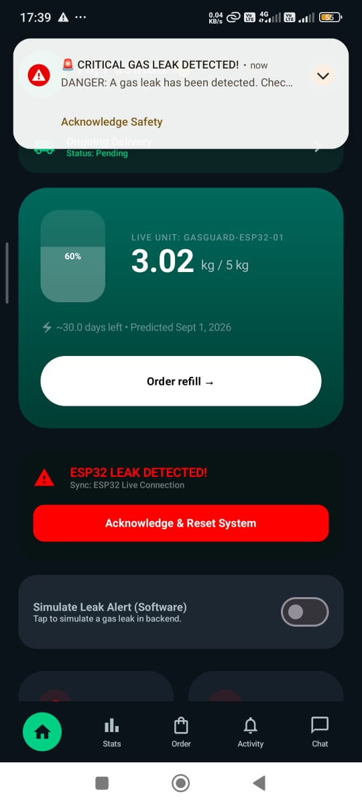

# 🔥 GasGuard

<h2 align="center">
IoT & Machine Learning-Based LPG Monitoring and Safety System
</h2>

<p align="center">
  <b>Individual Design Project | 2026</b>
</p>

<p align="center">
  Real-Time Monitoring • Gas Leak Detection • Automatic Valve Control • ML Depletion Prediction
</p>

---

<p align="center">
  
  &nbsp;&nbsp;
  
</p>

<p align="center">
  <b>Smart Monitoring. Early Detection. Safer LPG Usage.</b>
</p>

<p align="center">
  <a href="https://github.com/Lilendra-Pasindu-Harsha/GasGuard">
    🔗 GitHub Repository
  </a>
  &nbsp;&nbsp; | &nbsp;&nbsp;
  <a href="https://www.capcut.com/editor/DFC981D9-8CB1-4FFD-B776-7D651037730F?workspaceId=7651768553015820309&spaceId=7651767861173715985&utm_medium=Product&utm_source=draftshare&utm_campaign=link">
    ▶️ Watch Project Video
  </a>
</p>

---

## 📌 About GasGuard

**GasGuard** is an IoT and Machine Learning-based LPG monitoring and safety system developed for households and small kitchens.

The system combines an **ESP32 DevKit V1**, gas and weight sensors, Firebase cloud services, a React Native mobile application, automatic valve control, and a Machine Learning model to provide:

- Real-time LPG level monitoring
- Gas leak detection
- Automatic valve shutoff
- Temperature and humidity monitoring
- LPG usage analysis
- Monthly cost estimation
- Depletion prediction
- Refill-date estimation
- Mobile safety notifications
- LPG refill ordering
- Customer–supplier communication

The main goal of GasGuard is to provide a low-cost smart LPG safety and monitoring solution while improving user awareness of cylinder condition and remaining gas.

---

# 🎯 Project Objectives

- Monitor the remaining LPG level in real time.
- Detect LPG leakage using the MQ-5 sensor.
- Automatically shut off the gas valve during a leak.
- Monitor cylinder weight using a load cell and HX711.
- Display local system information on an I²C LCD.
- Monitor temperature and humidity.
- Send live sensor data to Firebase.
- Provide remote monitoring through a mobile application.
- Analyse LPG usage and monthly cost.
- Predict the remaining cylinder usage time using Machine Learning.
- Estimate the next refill date.
- Support LPG refill ordering and delivery management.
- Enable customer–supplier communication.

---

# ✨ Main Features

## 🔍 Real-Time LPG Monitoring

GasGuard continuously monitors the current LPG cylinder condition.

The system displays:

- LPG weight
- Gas percentage
- Gas leak status
- Temperature
- Humidity
- Valve status
- Device status
- Usage history
- Predicted days remaining

Sensor information is transmitted from the ESP32 to **Firebase Realtime Database** through Wi-Fi.

---

## 🚨 Gas Leak Detection & Safety Control

The **MQ-5 gas sensor** continuously monitors the surrounding environment for LPG leakage.

When the configured gas threshold is exceeded:

1. The system detects the unsafe condition.
2. The green status LED turns off.
3. The red warning LED activates.
4. The buzzer provides an audible warning.
5. The LCD displays a gas-leak warning.
6. The MG995 servo closes the gas valve.
7. The leak event is recorded in Firebase.
8. The mobile application displays a critical safety alert.

The main safety response is performed locally by the ESP32 and therefore does not depend completely on internet availability.

### Gas Detection Logic

| Condition | MQ-5 Reading | System Status |
|---|---:|---|
| Normal Air | Below 500 | Safe |
| Gas Detected | Above 500 | Leakage Alert |
| Gas Cleared | Below 500 | Normal Mode |

---

## ⚙️ Automatic Valve Control

An **MG995 servo motor** is mechanically connected to the LPG valve mechanism.

The servo provides automatic valve control during a detected gas leak.

```text
Normal Condition
        ↓
Valve Open
        ↓
Gas Leak Detected
        ↓
Buzzer + Red LED
        ↓
Servo Activated
        ↓
Valve Closed
        ↓
Firebase Event + Mobile Alert
```

This provides an additional automatic safety response instead of depending only on a warning alarm.

---

# 📱 GasGuard Mobile Application

<p align="center">
  
</p>

The GasGuard mobile application was developed using **React Native**.

The application provides both customer-side monitoring and supplier-side management functions.

### Customer Features

- Live LPG level
- Cylinder weight
- Gas leakage status
- Valve condition
- Temperature and humidity
- Usage statistics
- Monthly cost estimation
- Predicted days remaining
- Predicted refill date
- Safety notifications
- Refill ordering
- Payment selection
- Google Maps location sharing
- Activity history
- Customer–supplier chat

### Supplier Features

- Supplier dashboard
- Incoming LPG orders
- Order acceptance
- Out-for-delivery updates
- Delivered-order confirmation
- Inventory monitoring
- Sales information
- Customer communication
- Delivery-location viewing

---

# ☁️ Firebase Cloud Integration

GasGuard uses **Firebase Realtime Database** as the main cloud data platform.

The ESP32 periodically uploads sensor and system information to Firebase.

Typical database information includes:

```text
gasguard/
├── gas_weight
├── gas_percentage
├── gas_status
├── temperature
├── humidity
├── valve_state
└── device_status

orders/
customers/
dealers/
inventory/
chats/
conversations/
gas_stats/
system/
```

Normal sensor information is synchronized periodically, while important safety events are uploaded when hazardous conditions are detected.

The React Native application reads this data to provide near real-time monitoring.

---

# 🤖 Machine Learning-Based LPG Depletion Prediction

GasGuard includes a **Multiple Linear Regression** model to predict the number of LPG usage days remaining.

The Machine Learning pipeline uses historical LPG usage information and engineered features to learn the relationship between cylinder condition and depletion time.

---

## 📊 Machine Learning Dataset

| Metric | Value |
|---|---|
| Prediction Purpose | LPG depletion-time prediction |
| Model Type | Multiple Linear Regression |
| Dataset Size | 180 records |
| Input Features | 9 |
| Training / Testing Split | 80% / 20% |
| Feature Scaling | StandardScaler |
| Optimization | Batch Gradient Descent |
| Training Epochs | 100 |
| Learning Rate | 0.03 |
| Testing R² Score | 98.83% |
| MAE | 1.618 days |
| RMSE | 1.877 days |
| MAPE | 12.99% |
| 5-Fold CV | 93.16% ± 10.93% |

---

## 🧠 Engineered Features

The model uses nine predictive features:

1. `gas_weight_kg`
2. `gas_percentage`
3. `daily_usage_kg`
4. `day_of_week`
5. `weekend`
6. `consumption_rate`
7. `usage_velocity`
8. `rolling_avg_7`
9. `days_since_refill`

### Prediction Target

```text
days_remaining
```

---

## 📈 Model Training

The model was optimized using **Batch Gradient Descent for 100 epochs**.

Several learning rates were evaluated during development.

The selected learning rate was:

```text
Learning Rate = 0.03
```

The training process included:

```text
Historical LPG Dataset
        ↓
Data Cleaning
        ↓
Feature Engineering
        ↓
Train/Test Split
        ↓
StandardScaler
        ↓
Multiple Linear Regression
        ↓
100 Gradient Descent Epochs
        ↓
Model Evaluation
        ↓
5-Fold Cross-Validation
        ↓
PKL Model Export
```

---

## 📐 Final Prediction Equation

The final trained model produced the following prediction equation:

```text
Days_Remaining =
27.3480
+ 5.5789(gas_weight)
+ 0.2789(gas_percentage)
- 20.2193(daily_usage)
+ 0.2142(day_of_week)
+ 0.5944(weekend)
- 96.5310(consumption_rate)
- 60.2001(usage_velocity)
- 277.5059(rolling_avg_7)
- 0.0240(days_since_refill)
```

> Note: `gas_percentage` is directly related to `gas_weight_kg` for the fixed cylinder capacity, creating strong correlation between these two features. Individual regression coefficients should therefore be interpreted carefully.

---

# 🛠️ Hardware Components

| Component | Purpose |
|---|---|
| ESP32 DevKit V1 | Main controller and Wi-Fi communication |
| MQ-5 Gas Sensor | LPG leakage detection |
| 20 kg Load Cell | LPG cylinder weight measurement |
| HX711 Module | Load-cell signal amplification |
| DHT22 | Temperature and humidity measurement |
| MG995 Servo Motor | Automatic LPG valve control |
| 16×2 I²C LCD | Local system information |
| Active Buzzer | Audible leak warning |
| Green LED | Safe-condition indication |
| Red LED | Gas-leak warning |
| LM2596 Buck Converter | DC voltage regulation |
| Custom Wooden Structure | Prototype and valve mounting |

---

# 🔌 ESP32 Pin Configuration

| Device | ESP32 Pin |
|---|---:|
| MQ-5 Analog Output | GPIO 34 |
| DHT22 | GPIO 27 |
| HX711 DT | GPIO 25 |
| HX711 SCK | GPIO 26 |
| LCD SDA | GPIO 21 |
| LCD SCL | GPIO 22 |
| Buzzer | GPIO 19 |
| Green LED | GPIO 23 |
| Red LED | GPIO 32 |
| MG995 Servo | GPIO 13 |

---

# ⚡ Power Architecture

The prototype uses regulated DC power for safe and stable operation.

```text
230 V AC
   ↓
AC–DC Adapter
   ↓
Low-Voltage DC
   ↓
LM2596 Regulation
   ↓
System Power Rails
```

The MG995 servo is powered from a regulated supply line because of its higher current demand.

A **common ground** is maintained between the ESP32 and servo power system.

---

# 🖥️ Local LCD Interface

The 16×2 I²C LCD provides local system information without requiring the mobile application.

Typical information displayed includes:

```text
Gas Level
Cylinder Weight
Temperature
Humidity
Gas Status
Valve Status
Leak Warning
```

During a hazardous condition:

```text
LEAK DETECTED!
VALVE CLOSED
```

---

# 🏗️ Prototype Development

<p align="center">
  
</p>

The final prototype was developed using a custom wooden structure to support:

- LPG cylinder placement
- Load-cell measurement
- Sensor mounting
- ESP32 control hardware
- LCD interface
- Servo-valve mechanism
- Wiring and power distribution

The structure was developed as a low-cost solution while allowing easy access during testing and calibration.

---

# 🎓 Individual Design Project

<p align="center">
  
</p>

GasGuard was developed as an **Individual Design Project in Electronics and Telecommunication Engineering**.

The project provided hands-on experience across several engineering areas:

- Embedded Systems
- Sensor Interfacing
- IoT
- Cloud Computing
- Machine Learning
- Mobile Application Development
- Automatic Control
- Hardware Prototyping
- Data Analysis
- System Testing

---

# 🧪 Technical Challenges & Solutions

## 1. Unstable Load Cell Readings

The load cell produced changing readings due to vibration, uneven cylinder placement, electrical noise, and HX711 drift.

The issue was reduced using:

- Calibration with known weights
- Tare correction
- Improved mechanical mounting
- Central cylinder placement
- Software filtering

---

## 2. Power Supply Instability

Voltage drops caused unstable sensor readings and ESP32 resets.

An **LM2596 buck converter** was used to provide a stable DC supply. The servo was powered through a suitable regulated line with a common ground.

---

## 3. I²C LCD Communication Issues

The LCD initially displayed black blocks or no characters because of incorrect addressing and communication problems.

The issue was solved by:

- Running an I²C scanner
- Selecting the correct LCD address
- Setting the I²C clock to 100 kHz
- Adjusting the contrast potentiometer
- Checking SDA/SCL connections
- Checking solder joints

---

## 4. MQ-5 Environmental Variations

MQ-5 readings changed with temperature, humidity, warm-up time, and surrounding air conditions.

The sensor was tested under different conditions and the detection threshold was adjusted to improve leak detection while reducing false alarms.

---

## 5. MG995 Servo Power & Mounting

The MG995 required high current during operation and caused voltage drops during early tests.

Two servo motors were damaged during initial prototype testing due to an unsuitable power arrangement.

The issue was solved using:

- Regulated servo power
- Separate servo supply line
- Common ground
- Improved wiring
- Custom wooden servo mounting
- Better valve alignment

---

## 6. Limited Machine Learning Dataset

The Machine Learning model used **180 historical LPG records**, which limits its ability to represent every household and cylinder condition.

The model was improved using:

- Nine engineered features
- 80/20 train-test split
- StandardScaler
- 100 Gradient Descent epochs
- Learning-rate evaluation
- 5-fold cross-validation

Future development will use larger datasets covering different LPG cylinder capacities and household usage patterns.

---

# 🧰 Technology Stack

## Embedded & Hardware

```text
ESP32 DevKit V1
Embedded C/C++
Arduino IDE
MQ-5
HX711
Load Cell
DHT22
MG995 Servo
I²C LCD
LM2596
```

## Cloud

```text
Firebase Realtime Database
HTTPS
Wi-Fi
```

## Mobile Application

```text
React Native
JavaScript
Kotlin / Java Android Modules
Google Maps
Android Foreground Services
Mobile Notifications
```

## Machine Learning

```text
Python
NumPy
Pandas
Scikit-learn
Matplotlib
Multiple Linear Regression
StandardScaler
Gradient Descent
5-Fold Cross-Validation
```

## Development Tools

```text
Visual Studio Code
Google Colab
Git
GitHub
Arduino IDE
Android Studio
Firebase Console
```

---

# 📂 Repository Structure

```text
GasGuard/
│
├── assets/
│   ├── gasguard-prototype.jpg
│   ├── gasguard-mobile-alert.jpg
│   ├── gasguard-qr.jpg
│   └── gasguard-exhibition.jpg
│
├── Database/
│   └── Firebase database resources
│
├── GasGuard_App/
│   └── React Native mobile application
│
├── GasGuard_App Apk/
│   └── Android APK
│
├── GasGuard_Diagnostics_Tools/
│   └── Hardware and sensor diagnostic tools
│
├── GasGuard_ML/
│   ├── Dataset
│   ├── ML training notebook
│   ├── Model evaluation results
│   ├── gasguard_model.pkl
│   ├── gasguard_scaler.pkl
│   └── Performance plots
│
├── NewFullcode/
│   └── Main ESP32 firmware
│
├── Testing_Codes/
│   └── Individual hardware testing programs
│
├── GasGuard_PCB Image.jpeg
├── LICENSE
└── README.md
```

---

# 🚀 Running GasGuard

## 1️⃣ ESP32 Firmware

1. Open the main firmware using Arduino IDE.
2. Install the required ESP32 libraries.
3. Configure Wi-Fi and Firebase credentials locally.
4. Connect all sensors according to the ESP32 pin configuration.
5. Select the ESP32 DevKit V1 board.
6. Select the correct COM port.
7. Upload the firmware.
8. Open Serial Monitor to verify sensor values.

> ⚠️ Never commit Wi-Fi passwords, Firebase private credentials, or unrestricted API keys to a public GitHub repository.

---

## 2️⃣ React Native Application

Navigate to the mobile application folder:

```bash
cd GasGuard_App
```

Install dependencies:

```bash
npm install
```

Run the Android application:

```bash
npx react-native run-android
```

Firebase and Google Maps must be configured before running the complete application.

---

## 3️⃣ Machine Learning Model

Navigate to:

```bash
cd GasGuard_ML
```

Install required Python packages:

```bash
pip install numpy pandas scikit-learn matplotlib
```

Run the training script:

```bash
python gasguard_model_training.py
```

The training pipeline can generate:

```text
gasguard_model.pkl
gasguard_scaler.pkl
training_history_100_epochs.csv
model_comparison.csv
test_predictions.csv
gasguard_metrics.json
```

---

# 🔮 Future Improvements

Future development of GasGuard can include:

- Larger real-world LPG datasets
- 2.5 kg, 5 kg, and 12.5 kg cylinder support
- Four-load-cell weighing platform
- Li-ion battery backup
- Battery percentage monitoring
- Kalman filtering
- Improved consumption prediction
- Additional safety sensors
- Servo current monitoring
- Stronger Firebase authentication
- Firebase App Check
- Long-term household testing
- Improved supplier delivery management

---

# 🔐 Security Note

Development credentials should never be included directly in public source code.

Before publishing:

- Remove Wi-Fi SSID and passwords
- Remove Firebase private credentials
- Restrict Google Maps API keys
- Apply Firebase Authentication
- Apply secure Realtime Database rules
- Use environment/configuration files where possible

---

# ⚠️ Safety Notice

**GasGuard is an educational engineering prototype.**

It is not a certified commercial or industrial LPG safety device and should not replace approved gas regulators, certified gas detectors, safety valves, or professional LPG inspections.

Any real-world deployment should follow applicable electrical, fire, and LPG safety standards.

---

# 📸 Project Gallery

<table>
  <tr>
    <td align="center">
      <br>
      <b>GasGuard Prototype</b>
    </td>
    <td align="center">
      <br>
      <b>Mobile Gas Leak Alert</b>
    </td>
  </tr>
  <tr>
    <td align="center">
      <br>
      <b>Individual Design Project</b>
    </td>
    <td align="center">
      <br>
      <b>Scan to Explore GasGuard</b>
    </td>
  </tr>
</table>

---

# 🔗 Explore GasGuard

<p align="center">
  
</p>

<p align="center">
  <b>Scan the QR code to explore the GasGuard project.</b>
</p>

### Repository

```text
https://github.com/Lilendra-Pasindu-Harsha/GasGuard
```

### Project Video

```text
https://www.capcut.com/editor/DFC981D9-8CB1-4FFD-B776-7D651037730F?workspaceId=7651768553015820309&spaceId=7651767861173715985&utm_medium=Product&utm_source=draftshare&utm_campaign=link
```

---

# 👨‍💻 Developer

**WALP Harsha**

Electronics & Telecommunication Engineering Undergraduate  
General Sir John Kotelawala Defence University  
Sri Lanka 🇱🇰

### Areas of Interest

```text
Embedded Systems
Internet of Things
Machine Learning
Electronics
Telecommunication
Cloud Integration
Mobile Application Development
Automation
```

---

# 📄 License

This project is distributed according to the terms provided in the repository's `LICENSE` file.

---

<p align="center">
  <b>🔥 GasGuard</b>
</p>

<p align="center">
  <b>Smart Monitoring • Early Detection • Safer LPG Usage</b>
</p>

<p align="center">
  IoT + Embedded Systems + Machine Learning + Cloud + Mobile
</p>
