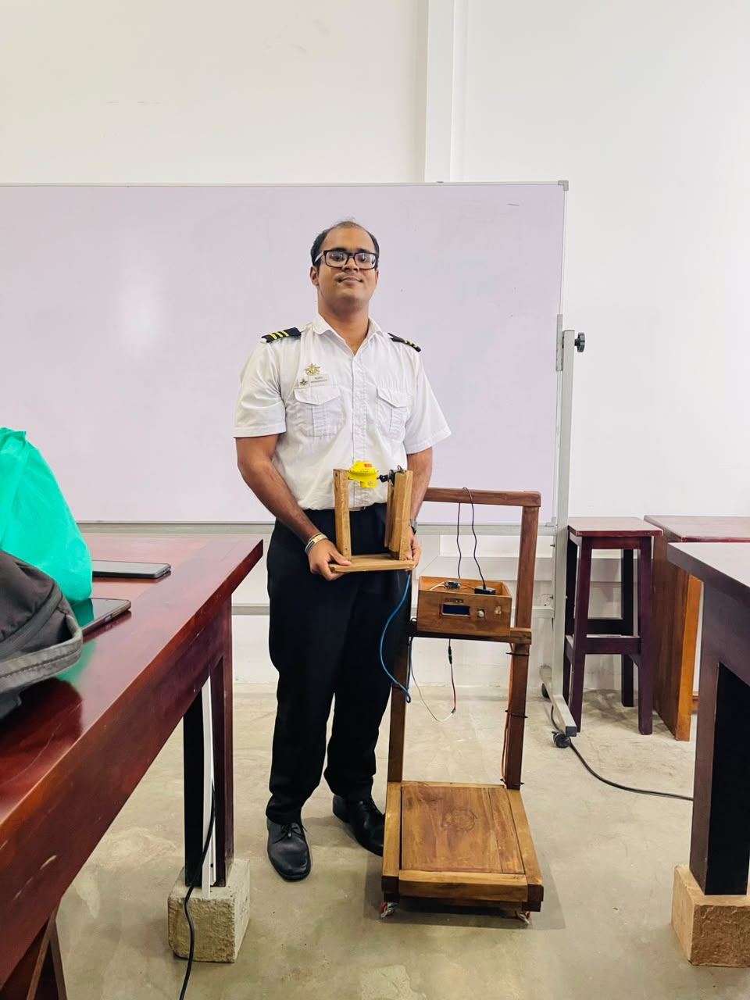
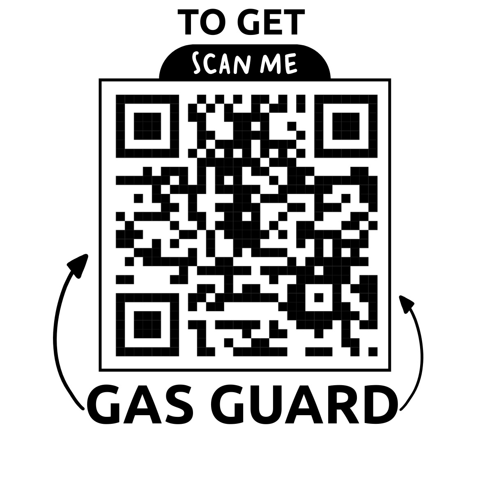

# 🔥 GasGuard

<h2 align="center">
IoT & Machine Learning-Based LPG Monitoring and Safety System
</h2>

<p align="center">
  <b>Individual Design Project | 2026</b>
</p>

<p align="center">
  <b>Real-Time LPG Monitoring • Gas Leak Detection • Automatic Valve Control • ML Depletion Prediction</b>
</p>

---

<p align="center">
  
  &nbsp;&nbsp;
  
</p>

<p align="center">
  <b>Smart Monitoring. Early Detection. Safer LPG Usage.</b>
</p>

<p align="center">
  <a href="https://github.com/Lilendra-Pasindu-Harsha/GasGuard">
    🔗 GitHub Repository
  </a>
  &nbsp;&nbsp; | &nbsp;&nbsp;
  <a href="https://www.capcut.com/editor/DFC981D9-8CB1-4FFD-B776-7D651037730F?workspaceId=7651768553015820309&spaceId=7651767861173715985&utm_medium=Product&utm_source=draftshare&utm_campaign=link">
    ▶️ Watch Project Video
  </a>
</p>

---

## 📌 About GasGuard

**GasGuard** is an IoT and Machine Learning-based LPG monitoring and safety system developed for households and small kitchens.

The system combines an **ESP32 DevKit V1**, gas and weight sensors, Firebase cloud services, a React Native mobile application, automatic valve control, and a Machine Learning model.

GasGuard provides:

- Real-time LPG level monitoring
- LPG weight measurement
- Gas leak detection
- Automatic gas valve shutoff
- Temperature and humidity monitoring
- Mobile safety alerts
- LPG usage analysis
- Monthly cost estimation
- ML-based depletion prediction
- Predicted refill date
- LPG refill ordering
- Google Maps location sharing
- Customer–supplier communication
- Supplier order and inventory management

---

# 🎯 Project Objectives

- Monitor remaining LPG level in real time.
- Detect LPG leakage using the MQ-5 sensor.
- Measure cylinder weight using a load cell and HX711.
- Automatically close the gas valve during a leak.
- Monitor temperature and humidity.
- Display system information using an I²C LCD.
- Upload sensor data to Firebase.
- Provide remote monitoring through a mobile application.
- Analyse LPG usage and cost.
- Predict remaining cylinder usage time.
- Estimate the next refill date.
- Allow customers to place LPG refill orders.
- Support communication between customers and suppliers.

---

# ✨ Main Features

## 🔍 Real-Time LPG Monitoring

GasGuard continuously monitors the LPG cylinder and displays:

- LPG weight
- Gas percentage
- Gas leak status
- Temperature
- Humidity
- Valve condition
- Usage history
- Estimated days remaining
- Predicted refill date

Sensor data are transmitted from the ESP32 to **Firebase Realtime Database** through Wi-Fi.

---

## 🚨 Gas Leak Detection

The **MQ-5 gas sensor** continuously monitors the surrounding environment.

When the configured gas threshold is exceeded, GasGuard performs an automatic safety response.

### Safety Actions

- Green LED turns OFF
- Red warning LED activates
- Buzzer alarm activates
- LCD displays leak warning
- MG995 servo closes the LPG valve
- Gas leak event is recorded in Firebase
- Mobile application displays a critical notification

The main safety response is processed locally by the ESP32, allowing leak detection and valve control even if the internet connection is unavailable.

### Gas Detection Logic

| Condition | MQ-5 Reading | System Status |
|---|---:|---|
| Normal Air | Below 500 | Safe |
| Gas Detected | Above 500 | Leakage Alert |
| Gas Cleared | Below 500 | Normal Mode |

---

# ⚙️ Automatic Valve Control

The **MG995 servo motor** controls the LPG valve during unsafe conditions.

```text
Normal Condition
       ↓
Valve Open
       ↓
MQ-5 Detects Gas Leak
       ↓
Red LED + Buzzer
       ↓
LCD Warning
       ↓
MG995 Servo Activated
       ↓
Valve Closed
       ↓
Firebase Event
       ↓
Mobile Alert
```

This provides an automatic physical safety response instead of relying only on an alarm.

---

# 📱 GasGuard Mobile Application

<p align="center">
  
</p>

The GasGuard mobile application was developed using **React Native**.

It provides both customer-side monitoring and supplier-side management.

## Customer Features

- Live LPG level
- Cylinder weight
- Gas leak status
- Valve status
- Temperature and humidity
- Usage statistics
- Monthly cost estimation
- Predicted days remaining
- Predicted refill date
- Gas leak notifications
- Refill ordering
- Payment selection
- Google Maps location sharing
- Order history
- Activity history
- Customer–supplier chat

## Supplier Features

- Supplier dashboard
- Incoming orders
- Order acceptance
- Out-for-delivery updates
- Delivery confirmation
- Inventory monitoring
- Sales information
- Customer communication
- Delivery-location viewing
- Order status management

---

# ☁️ Firebase Cloud Integration

GasGuard uses **Firebase Realtime Database** to connect the embedded hardware and mobile application.

The ESP32 periodically uploads:

```text
LPG Weight
Gas Percentage
Temperature
Humidity
Gas Status
Valve Status
Device Status
Safety Events
```

The Firebase database also manages:

```text
customers/
dealers/
devices/
gas_stats/
gasguard/
inventory/
orders/
chats/
conversations/
system/
```

Normal sensor readings are synchronized periodically, while important gas-leak events are transmitted during hazardous conditions.

---

# 🤖 Machine Learning-Based Depletion Prediction

GasGuard includes a **Multiple Linear Regression** model to estimate the number of LPG usage days remaining.

The model uses historical LPG consumption data and engineered features to identify gas usage patterns and estimate cylinder depletion time.

---

## 🧠 Machine Learning Model

| Metric | Value |
|---|---|
| Prediction Purpose | LPG cylinder depletion-time prediction |
| Model Type | Multiple Linear Regression |
| Dataset Size | 180 records |
| Input Features | 9 engineered features |
| Training / Testing Split | 80% / 20% |
| Feature Scaling | StandardScaler |
| Optimization Method | Batch Gradient Descent |
| Training Epochs | 100 |
| Learning Rate | 0.03 |
| Testing R² Score | 98.83% |
| MAE | 1.618 days |
| RMSE | 1.877 days |
| MAPE | 12.99% |
| 5-Fold Cross-Validation | 93.16% ± 10.93% |

---

## 📊 Machine Learning Input Features

The final model uses nine predictive features:

1. `gas_weight_kg`
2. `gas_percentage`
3. `daily_usage_kg`
4. `day_of_week`
5. `weekend`
6. `consumption_rate`
7. `usage_velocity`
8. `rolling_avg_7`
9. `days_since_refill`

### Prediction Target

```text
days_remaining
```

---

## 📈 Machine Learning Pipeline

```text
Historical LPG Dataset
        ↓
Data Cleaning
        ↓
Feature Engineering
        ↓
9 Predictive Features
        ↓
80 / 20 Train-Test Split
        ↓
StandardScaler
        ↓
Multiple Linear Regression
        ↓
Batch Gradient Descent
        ↓
100 Training Epochs
        ↓
Model Evaluation
        ↓
5-Fold Cross-Validation
        ↓
PKL Model Export
```

---

## 📐 Final Prediction Equation

```text
Days_Remaining =
27.3480
+ 5.5789(gas_weight)
+ 0.2789(gas_percentage)
- 20.2193(daily_usage)
+ 0.2142(day_of_week)
+ 0.5944(weekend)
- 96.5310(consumption_rate)
- 60.2001(usage_velocity)
- 277.5059(rolling_avg_7)
- 0.0240(days_since_refill)
```

> **Note:** Gas percentage is directly related to gas weight for a fixed 5 kg cylinder. Therefore, these two variables have strong correlation and their coefficients should not be interpreted independently.

---

# 📊 Model Comparison

| Model | R² Score | MAE | RMSE | Improvement |
|---|---:|---:|---:|---:|
| Linear Regression | 98.5230% | 1.8255 days | 2.1117 days | Baseline |
| Ridge (L2) | 98.5108% | 1.8288 days | 2.1204 days | -0.0121% |
| Lasso (L1) | 98.5338% | 1.8199 days | 2.1040 days | +0.0108% |
| Polynomial Degree 2 | 98.2314% | 1.8231 days | 2.3107 days | -0.2915% |

Linear Regression was selected because it provides a strong balance between prediction accuracy, simplicity, interpretability, and low computational cost.

---

# 🛠️ Hardware Components

| Component | Purpose |
|---|---|
| ESP32 DevKit V1 | Main controller and Wi-Fi communication |
| MQ-5 Gas Sensor | LPG leakage detection |
| 20 kg Load Cell | Cylinder weight measurement |
| HX711 Module | Load-cell signal amplification |
| DHT22 Sensor | Temperature and humidity monitoring |
| MG995 Servo Motor | Automatic valve control |
| 16×2 I²C LCD | Local data display |
| Active Buzzer | Gas leak alarm |
| Green LED | Safe status |
| Red LED | Leak warning |
| LM2596 Buck Converter | Voltage regulation |
| Custom Wooden Structure | Prototype housing and mounting |

---

# 🔌 ESP32 Pin Configuration

| Device | ESP32 Pin |
|---|---:|
| MQ-5 Analog Output | GPIO 34 |
| DHT22 | GPIO 27 |
| HX711 DT | GPIO 25 |
| HX711 SCK | GPIO 26 |
| LCD SDA | GPIO 21 |
| LCD SCL | GPIO 22 |
| Buzzer | GPIO 19 |
| Green LED | GPIO 23 |
| Red LED | GPIO 32 |
| MG995 Servo | GPIO 13 |

---

# ⚡ Power Architecture

```text
230 V AC
    ↓
AC-DC Adapter
    ↓
Low Voltage DC
    ↓
LM2596 Buck Converter
    ↓
Regulated DC Supply
    ↓
ESP32 + Sensors + Servo
```

The MG995 servo uses a regulated supply because of its higher current requirement.

A common ground is maintained between the ESP32 and servo power system.

---

# 🖥️ Local LCD Interface

The 16×2 I²C LCD displays important system information locally.

Typical information includes:

```text
Gas Level
Cylinder Weight
Temperature
Humidity
Gas Status
Valve Status
System Status
```

During a leak:

```text
LEAK DETECTED!
VALVE CLOSED
```

---

# 🏗️ GasGuard Prototype

<p align="center">
  
</p>

The final GasGuard prototype uses a custom wooden structure to support:

- LPG cylinder placement
- Load-cell platform
- ESP32 controller
- MQ-5 sensor
- DHT22 sensor
- LCD display
- Buzzer and LEDs
- Servo valve mechanism
- Wiring and power components

The structure was developed as a low-cost and practical prototype for testing and demonstration.

---

# 🎓 Individual Design Project

<p align="center">
  
</p>

GasGuard was developed as an **Individual Design Project in Electronics and Telecommunication Engineering**.

The project combines knowledge from:

- Embedded Systems
- Internet of Things
- Electronics
- Sensor Interfacing
- Automatic Control
- Cloud Computing
- Machine Learning
- Mobile Application Development
- Data Analysis
- System Testing
- Hardware Prototyping

---

# 🧪 Technical Challenges & Solutions

## 1️⃣ Unstable Load Cell Readings

The load cell produced changing readings due to vibration, uneven cylinder placement, electrical noise, and HX711 drift.

The issue was reduced through:

- Calibration using reference weights
- Tare correction
- Firm load-cell mounting
- Correct cylinder placement
- Software filtering

---

## 2️⃣ Power Supply Instability

Voltage drops caused unstable sensor readings and occasional ESP32 resets.

An **LM2596 buck converter** was used to provide a stable DC supply.

The servo was connected through a suitable regulated power line with a common ground.

---

## 3️⃣ I²C LCD Communication Issues

The LCD initially displayed black blocks or no characters due to incorrect addressing and communication errors.

The issue was solved by:

- Using an I²C scanner
- Finding the correct address
- Setting the I²C clock to 100 kHz
- Adjusting the contrast potentiometer
- Checking SDA and SCL connections
- Checking solder joints

---

## 4️⃣ MQ-5 Environmental Variations

MQ-5 sensor readings changed with:

- Temperature
- Humidity
- Warm-up time
- Surrounding air conditions

The sensor was tested under different conditions and the detection threshold was adjusted to improve leak detection and reduce false alarms.

---

## 5️⃣ MG995 Servo Power & Mounting Issues

The MG995 servo required high current and caused voltage drops during operation.

Two servo motors were damaged during early testing due to an unsuitable power arrangement.

The issue was solved using:

- Regulated 5 V servo supply
- Separate servo power line
- Common ground
- Improved wiring
- Custom wooden servo mount
- Better valve alignment

---

## 6️⃣ Limited Machine Learning Dataset

The model was trained using only **180 historical records from a 5 kg LPG cylinder**.

This limits model generalization across different households and cylinder capacities.

The issue was reduced by using:

- Nine engineered features
- 80/20 data split
- StandardScaler
- 100 Gradient Descent epochs
- Learning-rate optimization
- 5-fold cross-validation

Future development will include larger datasets and different cylinder capacities.

---

# 🧰 Technology Stack

## 🔧 Embedded Systems

```text
ESP32 DevKit V1
Embedded C/C++
Arduino IDE
MQ-5
HX711
Load Cell
DHT22
MG995 Servo
I²C LCD
LM2596
```

## ☁️ Cloud

```text
Firebase Realtime Database
Wi-Fi
HTTPS
```

## 📱 Mobile

```text
React Native
JavaScript
Kotlin / Java
Google Maps API
Android Foreground Services
Mobile Notifications
```

## 🤖 Machine Learning

```text
Python
NumPy
Pandas
Scikit-learn
Matplotlib
Multiple Linear Regression
StandardScaler
Gradient Descent
5-Fold Cross-Validation
```

## 💻 Development Tools

```text
Visual Studio Code
Google Colab
Git
GitHub
Arduino IDE
Android Studio
Firebase Console
```

---

# 📂 Repository Structure

```text
GasGuard/
│
├── assets/
│   ├── gasguard-prototype.jpeg
│   ├── gasguard-mobile-alert.jpeg
│   ├── gasguard-qr.jpeg
│   └── gasguard-exhibition.jpeg
│
├── Database/
│   └── Firebase database resources
│
├── GasGuard_App/
│   └── React Native mobile application
│
├── GasGuard_App Apk/
│   └── Android APK
│
├── GasGuard_Diagnostics_Tools/
│   └── Sensor and system diagnostic tools
│
├── GasGuard_ML/
│   ├── Training dataset
│   ├── ML notebook
│   ├── Evaluation results
│   ├── Model comparison results
│   ├── gasguard_model.pkl
│   └── gasguard_scaler.pkl
│
├── NewFullcode/
│   └── Main ESP32 firmware
│
├── Testing_Codes/
│   └── Hardware and sensor testing codes
│
├── GasGuard_PCB Image.jpeg
├── LICENSE
└── README.md
```

---

# 🚀 Running the Project

## 1️⃣ ESP32 Firmware

1. Open the main firmware in Arduino IDE.
2. Install the required ESP32 libraries.
3. Configure Firebase and Wi-Fi settings locally.
4. Connect the hardware according to the pin table.
5. Select **ESP32 DevKit V1**.
6. Select the correct COM port.
7. Upload the firmware.
8. Open Serial Monitor to check system operation.

> ⚠️ Do not upload Wi-Fi passwords, Firebase secrets, or unrestricted API keys to GitHub.

---

## 2️⃣ React Native Mobile Application

Navigate to the mobile application:

```bash
cd GasGuard_App
```

Install packages:

```bash
npm install
```

Run the Android application:

```bash
npx react-native run-android
```

Firebase and Google Maps should be configured before running the full application.

---

## 3️⃣ Machine Learning Model

Navigate to:

```bash
cd GasGuard_ML
```

Install required packages:

```bash
pip install numpy pandas scikit-learn matplotlib
```

Run the training script:

```bash
python gasguard_model_training.py
```

The ML pipeline can generate:

```text
gasguard_model.pkl
gasguard_scaler.pkl
training_history_100_epochs.csv
model_comparison.csv
test_predictions.csv
gasguard_metrics.json
```

---

# 📸 Project Gallery

<table>
  <tr>
    <td align="center">
      <br>
      <b>GasGuard Prototype</b>
    </td>

    <td align="center">
      <br>
      <b>Mobile Gas Leak Alert</b>
    </td>
  </tr>

  <tr>
    <td align="center">
      <br>
      <b>Individual Design Project</b>
    </td>

    <td align="center">
      <br>
      <b>Scan to Explore GasGuard</b>
    </td>
  </tr>
</table>

---

# 🎬 Project Video

<p align="center">
  <a href="https://www.capcut.com/editor/DFC981D9-8CB1-4FFD-B776-7D651037730F?workspaceId=7651768553015820309&spaceId=7651767861173715985&utm_medium=Product&utm_source=draftshare&utm_campaign=link">
    ▶️ <b>Watch GasGuard Project Video</b>
  </a>
</p>

---

# 🔗 Explore GasGuard

<p align="center">
  
</p>

<p align="center">
  <b>Scan to explore the GasGuard project.</b>
</p>

### GitHub Repository

```text
https://github.com/Lilendra-Pasindu-Harsha/GasGuard
```

---

# 🔮 Future Improvements

- Collect a larger real-world LPG dataset.
- Support 2.5 kg, 5 kg, and 12.5 kg cylinders.
- Use four load cells for better weight distribution.
- Add Li-ion battery backup.
- Display battery percentage.
- Apply Kalman filtering.
- Improve depletion prediction.
- Add additional safety sensors.
- Monitor servo current and valve faults.
- Improve Firebase authentication.
- Enable Firebase App Check.
- Perform long-term household testing.
- Improve supplier delivery tracking.

---

# 🔐 Security

Before publishing the project publicly:

- Remove Wi-Fi passwords.
- Remove Firebase private credentials.
- Restrict Google Maps API keys.
- Enable Firebase Authentication.
- Apply secure Firebase database rules.
- Use environment/configuration files.
- Never commit secrets to GitHub.

---

# ⚠️ Safety Notice

**GasGuard is an educational engineering prototype.**

It is not a certified commercial or industrial LPG safety system.

It should not replace:

- Certified LPG detectors
- Approved gas regulators
- Certified safety valves
- Professional LPG inspections
- Applicable fire and electrical safety standards

---

# 👨‍💻 Developer

### WALP Harsha

**Electronics & Telecommunication Engineering Undergraduate**  
General Sir John Kotelawala Defence University  
Sri Lanka 🇱🇰

### Areas of Interest

```text
Embedded Systems
Internet of Things
Machine Learning
Electronics
Telecommunication
Cloud Computing
Mobile Application Development
Automation
```

---

# 📄 License

This project is distributed according to the terms provided in the repository's `LICENSE` file.

---

<h2 align="center">
🔥 GasGuard
</h2>

<p align="center">
  <b>Smart Monitoring • Early Detection • Safer LPG Usage</b>
</p>

<p align="center">
  IoT • Embedded Systems • Machine Learning • Cloud • Mobile
</p>
